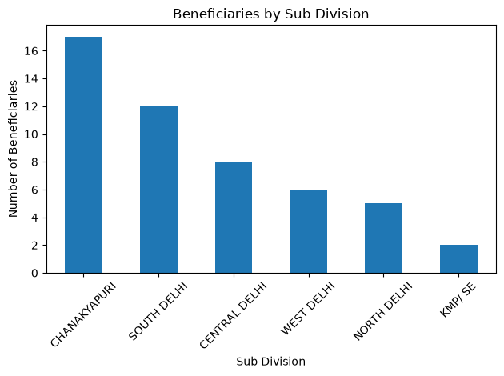
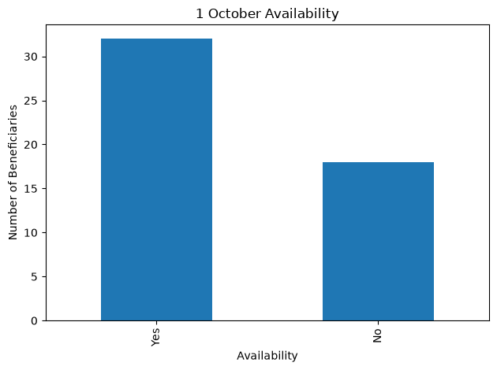
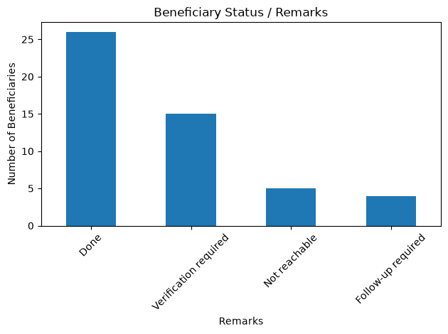

# Ladli Beneficiary Data Analysis

# Project Overview
This project was developed as part of my internship work supporting the review and organization of beneficiary records under a government welfare programme.
Using a synthetic dataset created for privacy protection, the project demonstrates how beneficiary information can be systematically reviewed using Python and Pandas. The analysis focuses on verification of beneficiary and guardian details, bank account information, eligibility documents, contact availability, subdivision-wise records, and follow-up status.

The objective was to support structured data review and identify records that may require verification or follow-up, while maintaining confidentiality of actual beneficiary information.

# Tools & Technologies
- Python
- Pandas
- Matplotlib
- Jupyter Notebook

# Analysis Performed
- Loaded and explored CSV data using Pandas
- Checked dataset structure using `head()`, `shape`, and `info()`
- Checked missing values
- Filtered beneficiaries based on subdivision
- Identified beneficiaries from Chanakyapuri subdivision
- Analyzed beneficiary verification records
- Checked phone number availability
- Analyzed beneficiary remarks/status
- Analyzed 1 October availability
- Created visualizations using Matplotlib

# Key Findings
- The dataset contains 50 beneficiary records.
- 17 beneficiaries belong to the Chanakyapuri subdivision.
- Verification fields were analyzed using Yes/No responses.
- Phone number availability was checked.
- Beneficiary remarks and 1 October availability were analyzed using Pandas.
- Charts were created to present the findings visually.

## 📊 Visualizations

### Beneficiaries by Sub Division

### 1 October Availability

### Beneficiary Remarks

# Project Files
| File | Description |
| `ladli_project.ipynb` | Jupyter Notebook containing the complete analysis |
| `ladli_dommy_50_realistic.csv` | Synthetic dataset used for analysis |

# Privacy Note
This project uses a synthetic dataset created for educational and demonstration purposes. No real beneficiary personal information is included.

# Learning Outcomes
Through this project, I practiced:
- Data loading and exploration
- Data filtering
- Missing-value analysis
- Categorical data analysis
- Basic data visualization
- Working with Pandas DataFrames
